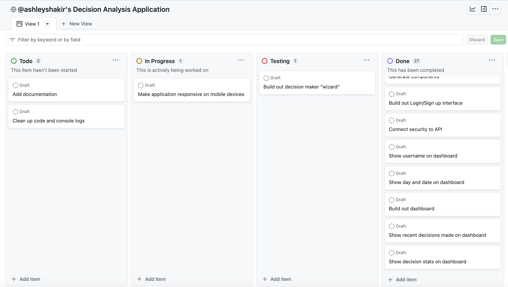

# Impactful Decisions 


## Project Description

Impactful Decisions is a web-based application designed to empower users to make informed and meaningful choices. In a world filled with countless decisions, this platform provides a structured framework for decision-making, allowing users to define decisions, list criteria, compare options, and analyze pros and cons to arrive at the best possible choice. This frontend, built with Angular, offers a user-friendly interface for interacting with the core features of the Impactful Decisions application.

# Table of Contents
- [Impactful Decisions](#impactful-decisions)
- [Project Description](#project-description)
- [Project Goals](#project-goals)
- [Project Approach](#project-approach)
  - [1. Planning and Project Documentation](#1-planning-and-project-documentation)
    - [GitHub Project Board](#github-project-board)
    - [User-Centric Design](#user-centric-design)
    - [Wireframes](#wireframes)
  - [2. Backend Development (Spring Boot)](#2-backend-development-spring-boot)
  - [3. Frontend Development (Angular)](#3-frontend-development-angular)
  - [4. User Experience Enhancement](#4-user-experience-enhancement)
- [Tools and Technologies Used](#tools-and-technologies-used)
- [Challenges During Development](#challenges-during-development)
- [Installation Instructions](#installation-instructions)
- [Acknowledgements](#acknowledgements)
  - [Images and Design Ideas](#images-and-design-ideas)
  - [General Assembly Instructors](#general-assembly-instructors)
  - [Project Lead and Developer](#project-lead-and-developer)
- [Conclusion](#conclusion)

## Project Goals

1. **Empowerment:** Enable users to make informed and impactful decisions aligned with their goals.

2. **User-Friendly:** Create an intuitive and user-friendly interface for ease of use.

3. **Structured Decision-Making:** Provide a step-by-step decision-making process, including defining decisions, criteria, options, and analysis.

4. **Authentication:** Implement user registration and login features to personalize the experience.

## Project Approach

### 1. Planning and Project Documentation

- **Objective:** Define the frontend project scope, deliverables, and timeline while ensuring a smooth project management process.
- **Tasks:** 
  - Create detailed user stories to outline frontend functionality.
  - Research and gather design inspiration and select color schemes.
  - Develop wireframes to visualize the user interface.
  - Set up and configure a GitHub project board for efficient task tracking.
- **Timeline:** October 18, 2023

#### GitHub Project Board

I have utilized GitHub Projects as a resource for project planning and management. You can view the project board [here](https://github.com/users/ashleyshakir/projects/5). Below is a screenshot of the GitHub project board as of October 26, 2023:



#### User-Centric Design
<details>
<summary><b>Registration and Login</b></summary>

- As a logged-out user, I can see a registration form to create a new account so that I can sign up for the application.
- As a logged-out user, I can access a login page to sign in to my account so that I can access my personalized dashboard.
</details>

<details>
<summary><b>User Dashboard and Decision Creation</b></summary>

- As a logged-in user, I can view the dashboard, which displays my most recent decisions and decision statistics so that I can keep track of my previous choices.
- As a logged-in user, I can initiate the process of creating a new decision by clicking on a "Start a New Decision" button so that I can make a thoughtful choice.
</details>

<details>
<summary><b>Decision, Criteria, Options, and Pros/Cons</b></summary>

- As a logged-in user, I can enter the decision title and description for a new decision and proceed to the next step so that I can provide context for my choice.
- As a logged-in user, I can add options for the decision on a dedicated page so that I can consider different possibilities.
- As a logged-in user, I can define criteria and their weights for the decision on a separate page so that I can specify the factors that matter to me.
- As a logged-in user, I can enter pros and cons for each option, associating them with criteria and assigning ratings, on separate pages so that I can thoroughly evaluate my choices.
</details>

<details>
<summary><b>Decision Summary and Results</b></summary>

- As a logged-in user, I can view a summary of the decision, including options, criteria, pros and cons for each option, and the decision title and description so that I can review my decision details.
- As a logged-in user, I can view the results of my decision, including option scores and a recommended choice, after completing the decision-making process so that I can make an informed decision.
- As a logged-in user, I can mark the decision as resolved so that I can keep track of the decisions made.
</details>

<details>
<summary><b>Logout</b></summary>

- As a user, I can log out of my account when done using the application so that I can secure my account and data.
</details>

#### Wireframes
I've visualized the user interface and user experience of the application using wireframes. Check out the [wireframes here](https://www.figma.com/file/9hfJ3WW6TEP8neGb9ZvlfV/Decision-Analysis-App?type=whiteboard&node-id=0%3A1&t=ZNxEbfmYb9IDe8xU-1) to get a glimpse of the app's design and layout.


### 2. Backend Development (Spring Boot)

- **Objective:** Create the backend infrastructure for the application.
- **Tasks:** 
  - Develop user management functionalities including registration and login.
  - Design and implement CRUD operations for all application models.
  - Conduct unit tests on service methods and carry out integration tests for API endpoints.
  - Implement and ensure user authentication and authorization mechanisms.
- **Timeline:** October 18, 2023 - October 20, 2023
- **Backend GitHub Repository** You can view the backend repository [here](https://github.com/ashleyshakir/impactful-decisions.git).

### 3. Frontend Development (Angular)

- **Objective:** Develop the user interface for the Impactful Decisions Application.
- **Tasks:** 
  - Create user registration and login interfaces. 
  - Implement authentication and JWT token handling. 
  - Design the user dashboard for decision management.
  - Build a wizard-like decision creation interface.
- **Timeline:** October 20, 2023 - October 26, 2023

### 4. User Experience Enhancement

- **Objective:** Enhance the user interface and overall user experience.
- **Tasks:**  
  - Implement responsive design for both mobile and desktop.
  - Improve UI/UX through intuitive navigation and cohesive visuals.
  - Integrate customized dialog boxes to provide clear user prompts and messages, elevating the interaction quality.
- **Timeline:** October 25, 2023 - October 26, 2023

## Tools and Technologies Used

- **Angular:** [Version: 16.2.10](https://angular.io/guide/versions)  Frontend framework for building dynamic web applications. 
    - **TypeScript:** [Version: ~5.1.3](https://www.typescriptlang.org/) The primary programming language used for developing Angular applications. 
    - **RxJS:** [Version 7.8.0](https://rxjs.dev/) Used for handling asynchronous operations. 
    - **Node.js:** A JavaScript runtime built on Chrome's V8 JavaScript engine for server-side and network applications. [Version 18.17.0](https://nodejs.org/en)
    - **Angular Material:** [Version: 16.2.9](https://material.angular.io/) A UI component library for Angular applications, providing a set of pre-built UI components. 
    - **NgCharts:** [Version: 5.0.3](https://github.com/valor-software/ng2-charts) An Angular library for adding charts and graphs to your application. 
    - **FontAwesome (for Angular):** [Version: 0.13.0](https://github.com/FortAwesome/angular-fontawesome) A library for integrating Font Awesome icons into Angular applications. 
- **HTML/CSS:** For structuring and styling the user interface.
- **FontAwesome:** [Version: 6.4.2](https://fontawesome.com/) A popular icon library for adding vector icons and social logos to your website. 
- **Figma:** An online design and prototyping tool for creating user interfaces and user experiences. [Official Website](https://www.figma.com/)
- **FlatIcon:** A platform for downloading free icons, vectors, and other graphic resources. [Official Website](https://www.flaticon.com/)
- **REST API:** Consumes data from the Impactful Decisions backend. [Github Repository](https://github.com/ashleyshakir/impactful-decisions.git)
- **GitHub:** Version control and collaboration platform.

## Challenges During Development
<details>
<summary><strong>Challenge:</strong> User Authentication and Displaying Usernames</summary>
<br>
While integrating the front-end with my API, I encountered a challenge when attempting to display the logged-in user's username on the dashboard. To address this, I undertook the task of refactoring the LoginResponse class to include a user object alongside the JWT token. This allowed me to extract the username from the response, which now contained the user object. 

<br>
</details>
<details>
<summary><strong>Challenge:</strong> Data Serialization </summary>
<br>
While building my full-stack application, I encountered a data serialization bug. The frontend was sending an object containing an array of options, but the backend was expecting a single option object. This mismatch caused an issue known as "HttpMessageNotReadableException" – basically, the server couldn't read the message.

<br>
To fix this, I had to align the data format on both sides. This involved debugging and adjusting the code on the backend to ensure the data matched. In the end, this resolved the communication problem between the frontend and backend.

<br>
</details>
<details>
<summary><strong>Challenge:</strong> JWT Token Refresh for Real-Time Updates</summary>
<br>
I encountered a challenging bug where the decisions displayed on the UI were not updating according to the currently logged-in user. Realized the root cause was stale JWT tokens in the HTTP headers used by the DecisionService. 

<br>
To resolve this, I integrated a dynamic header retrieval method within AuthService to fetch the most recent JWT token from local storage. This ensured that each HTTP request carried the latest token, aligning the fetched decisions with the current user session. Implementing this not only fixed the issue but also improved the application's overall data consistency and security.
</details>

## Installation Instructions
To run the frontend application of Impactful Decisions locally, follow these steps:

1. **Clone the Repository:** Use the following command to clone the frontend repository to your local machine:

   ```bash
   git clone git@github.com:ashleyshakir/frontend-impactful-decisions.git
2. **Navigate to the Project Directory:** Change your current directory to the cloned project folder:

    ```bash 
    cd frontend-impactful-decisions 
    ```
3. **Install Dependencies:** Install the project dependencies using Angular's package manager, npm:
    ```bash
    npm install
    ```
4. **Run the Development Server:** Start the development server to run the frontend locally:
    ```bash
    ng serve
    ```
5. **Access the Application:** Open your web browser and navigate to `http://localhost:4200/` to access the Impactful Decisions interface.
The application will automatically reload if you change any of the source files.

## Acknowledgements

### Images and Design Ideas
- <a href="https://storyset.com/people">People illustrations by Storyset</a>
- [Color Scheme](https://coolors.co/88e9c2-ff9920-ffdc71-064663-59d8e5)
- [Dashboard](https://dribbble.com/shots/11101900-Pitch-Dashboard/attachments/2701195?mode=media)
- [Decision Form](https://dribbble.com/shots/3076274-Card-Wizard)

### General Assembly Instructors

- Suresh Sigera: [GitHub](https://github.com/sureshmelvinsigera)
- Dhrubo Chowdhury: [GitHub](https://github.com/Dhrubo-Chowdhury)
- Leonardo Rodriguez: [GitHub](https://github.com/LRodriguez92)

### Project Lead and Developer

- Ashley Shakir: [GitHub](https://github.com/ashleyshakir) | [LinkedIn](https://www.linkedin.com/in/ashleymshakir/)


## Conclusion 🎉

Building the Impactful Decisions app has been a rewarding journey, filled with challenges and triumphs. My aim was to empower users in a world where decisions are constant. I envisioned a user-friendly platform that structures decision-making, from defining decisions and criteria to comparing options and analyzing pros and cons.

Throughout this project, I focused on user empowerment, user-friendliness, and structured decision-making. I implemented features like user registration and login for personalization, and created a step-by-step wizard-like interface to guide users.

Planning and project documentation set the foundation, and GitHub Projects kept me on track. User-Centric Design guided feature development, and wireframes ensured a user-friendly interface. Backend development with Spring Boot provided infrastructure, while Angular delivered a dynamic UI. I emphasized responsive design and intuitive navigation. Despite challenges like user authentication, data serialization, and JWT token refresh, I found solutions that contributed to the project's growth.

I've achieved my goal of providing a platform for impactful decisions. Thanks to all who supported me, including instructors, classmates, and family.

Thanks for joining me on this journey! 🚀